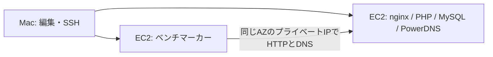

# ISUCON13 PHP：2週間の個人練習ロードマップ

作成・資料確認日: 2026-09-16

## 目標と進め方

**1週目はOrbStack内の環境とMac上のベンチマーカーで完結し、2週目は同じPHP実装を小さなAWS構成で再計測する。** まず「遅い理由を測定できる」「変更が正しい」「初期化・再起動後も再現できる」を目標にする。

日付は固定せず、Day 1から開始する。1日90〜120分、Day 7・14は約3時間を想定。遅れた場合は後半の発展課題を減らし、整合性確認を省略しない。以下の日程・合格条件・構成は、資料を踏まえた個人練習向けの提案。

- 手順: [ローカルPHPセットアップ](local-php.md)
- 読む順番と記事一覧: [参考資料集](practice-resources.md)
- 毎回の記録: [練習記録テンプレート](practice-log-template.md)

### 現在地

- OrbStackでnginx / PHP-FPM / MySQL / PowerDNSが起動する。
- 初期化API、タグ103件、配信検索1件、DNS名前解決、停止・起動後のDB保持を確認済み。
- **ベンチマーカーのビルド・pretest・本走行、ログ集計、性能改善は未確認。** この文書にあるベンチ用コマンドは次の作業手順であり、実行済みの結果ではない。
- PHP環境の準備と秘密情報の分離までを含む開始地点は `ebba2bd`。元mainの `40ea130` は比較用の履歴として維持する。
- `.env.local` はGit管理外。ローカル練習にもEC2上の通常のPHP実行にもAWSアクセスキーは不要。

## 全体の優先順位

1. ベンチの整合性チェックと本走行を成立させる。
2. HTTP・SQL・CPUのどこが時間を使っているか測る。
3. インデックスを、実際の重いSQLに対応させて追加する。
4. アイコンの読み出し・ハッシュ計算と条件付きGETを改善する。
5. N+1（一覧の件数に比例してSQL発行が増える処理）を1箇所ずつ減らす。
6. DNSの失敗率と登録処理を確認し、必要なときに改善する。
7. AWSで再測定し、余裕があればDB分離に進む。

ISUCON13ではHTTPリクエスト数自体ではなくTipsの投稿がスコアに結び付く。速くしたAPIがスコアに効かない場合は、シナリオのどこで待っているかを見直す。公式解説の改善順は手掛かりにし、計測結果に応じて順序を変える。[公式解説](https://isucon.net/archives/58001272.html)

## 1週目：ローカルで測定と改善を一周する

| 日 | テーマ・目安 | 作業 | 完了条件 | 読む資料 |
|---|---|---|---|---|
| Day 1 | ベンチを動かす・2h | マニュアル、PHPのroutes、DBスキーマを読む。Goでホスト用ベンチをビルドしpretestを実行。DNS/HTTP/初期化を切り分ける | pretest成功をログで確認し、本走行1回の結果を保存 | R1・R2・R3 |
| Day 2 | 測れる状態にする・2h | nginxにrequest_time/upstream_response_time付きアクセスログ、MySQLにslow logを設定。alpとpt-query-digestで集計。docker statsも取得 | 遅いAPI上位3件、SQL上位3件、CPU/メモリの状態を説明できる | R3・R9・R10 |
| Day 3 | SQLとインデックス・2h | 総時間の大きいSQLをEXPLAIN。検索条件・JOIN・ORDER BYに合わせ、インデックスを1件ずつ比較 | 少なくとも1件で実行計画と処理時間の変化を記録。初期化後も有効 | R2・R4 |
| Day 4 | アイコン処理・2h | User/FillUserResponseとアイコンGET/POSTを読む。不要な画像取得・ハッシュ再計算を減らし、If-None-Matchを扱う | アイコン新規/更新/未設定で正しい応答。更新反映とpretestに合格 | R1・R2 |
| Day 5 | N+1を1箇所解消・2h | LivecommentまたはReactionのレスポンス組立てを対象に、必要IDの一括取得とマップ化を試す | 対象APIのSQL回数減少を確認。順序・空配列・認可が維持される | R4・R5 |
| Day 6 | DNSとPHP実行環境・2h | 登録→DNS→HTTPをたどる。存在する/しない名前をdigで確認。FPMワーカー数・OPcacheの現状とメモリを確認 | DNS失敗とHTTP失敗を区別できる。設定変更は1項目だけ比較 | R2・R6・R7 |
| Day 7 | ローカル模擬練習・3h | 計測→仮説→1変更→pretest→本走行。最後に初期化・再起動して再実行 | 下記「AWSへ進む条件」を満たす。改善前後の記録を1枚にまとめる | 記録と必要部分の再読 |

### Day 1：ベンチマーカーの入口

ホスト上のGoを使う。現在のMacにはGoがあるが、別環境では `bench/go.mod` を満たすGoを準備する。PHPそのものは引き続きコンテナ内で動かす。依存ライブラリやイメージの初回ダウンロードにはインターネット接続が必要だが、測定対象はすべてローカルに置く。

```sh
# リポジトリのルート
make up
cd bench
# 全OS向けビルドはせず、現在のホスト用を1つだけ作る
go build -o bin/bench-local ./cmd/bench

./bin/bench-local run \
  --target http://pipe.u.isucon.dev:8080 \
  --nameserver 127.0.0.1 --dns-port 1053 \
  --pretest-only

# pretestの成功ログを確認してから、本走行
./bin/bench-local run \
  --target http://pipe.u.isucon.dev:8080 \
  --nameserver 127.0.0.1 --dns-port 1053
```

注意点:

- ベンチはアプリを初期化するので、手動で作ったデータは消える。作業中の設定とSQL変更は先にファイルへ保存する。
- `bench/cmd/bench/bench.go` の `run` が個人練習用の入口。`supervise` や `deploy_production` / `deploy_develop` は運営用AWS連携を含むので利用しない。ベンチ実行のために運営のAWSキーを用意する必要はない。
- 現実装には失敗でも終了コード0を返す経路がある。シェルの終了コードだけで成功と判断せず、整合性成功のログ、本走行の結果JSON、失敗メッセージを確認する。
- デフォルトでは `/tmp/contestant.log`・`/tmp/staff.log`・`/tmp/result.json` を使用する。各回の前に古い結果を区別し、実行ごとにコピーするか、ソースで確認した `--contestant-log-path` / `--staff-log-path` / `--result-path` で別名を指定する。
- `pipe.u.isucon.dev` をベンチ内のDNSリゾルバで解決する。IP直指定やmacOSのhosts編集でDNS検査を避けない。ブラウザは `.dev` のHTTPS強制の影響を受けるため、このHTTP練習はCLIを入口にする。
- `bench/assets/data/hash.txt` はフロントエンドビルド由来の生成物で現在存在しない。`bench/assets` パッケージを対象にするテスト等で必要になった場合は、生成元の `frontend/Makefile` を確認する。空ファイルを置いて検査を無意味にしない。

pretestが通らない場合は、(1)初期化API、(2)dig、(3)該当APIのログ、(4)ベンチの期待値、の順に切り分ける。Day 1で完了しなければDay 2へ持ち越し、Day 6の追加チューニングを省く。

### 毎回の測定ルール

- 1回の比較で変える要因は1つ。記事の改善を一括でコピーしない。
- 変更前後それぞれ原則3回、各回を同じ初期化条件で実行。中央値と最小〜最大、失敗回数を残す。
- GitのSHA、Dockerイメージ、CPU/メモリ制限、ベンチを動かす場所、ログ採取条件を揃える。
- アクセスログはIDごとに分散させず、例 `/api/livestream/:id/livecomment` にまとめて総処理時間・回数・平均・p95を見る。平均だけで判断しない。
- SQLは1回の遅さだけでなく、実行回数×所要時間を確認する。slow logの閾値が高いと大量の短いSQLを見落とす。
- FPM slowlogやプロファイラは調査時に使用し、最終比較では両方の条件を揃える。Macの他の重い処理は止める。
- スコア改善が測定のばらつきより小さければ「未確定」と書く。小さい差を成功扱いしない。
- スキーマ変更はSQLファイルへ保存する。MySQLの `/docker-entrypoint-initdb.d` は空のDBボリュームでの初回起動時だけ実行される。既存DBと完全再作成の両方で適用できる手順を用意する。

### PHPで読む場所

| 課題 | 主なファイル | 確認すること |
|---|---|---|
| APIの入口 | `webapp/php/app/routes.php` | ベンチのシナリオとAPIの対応 |
| アイコン・利用者情報 | `webapp/php/src/User/Handler.php`、`User/FillUserResponse.php` | 画像の取得回数、ハッシュ計算、更新反映 |
| 一覧の組立て | `Livecomment/FillLivecommentResponse.php`、`Reaction/Handler.php`、`Livestream/FillLivestreamResponse.php`（いずれも `webapp/php/src/` 以下） | ループ内SQL、一括取得、結果の順序 |
| 統計 | `webapp/php/src/Stats/Handler.php` | 全件取得・集計、ランキングの同点処理 |
| 初期化 | `webapp/sql/init.sh`、`init.sql`、`initdb.d/` | キャッシュ・追加カラム・インデックスとの整合性 |
| DNS | `webapp/pdns/init_zone.sh`、PHPの登録処理 | 登録した名前が即時に引けるか |
| PHP実行 | `development/php/usr/local/etc/php-fpm.d/zz-docker.conf` | 子プロセス数、メモリ使用量、待ち行列 |

OPcacheを試す場合、まず有効状態を確認する。ローカルではコード変更の反映を維持し、タイムスタンプ検証を止める設定を採るなら、デプロイ時のFPM再起動まで手順に含める。bcryptのコスト削減など、仕様を変える最適化はマニュアルの許容範囲を先に確認する。

### AWSへ進む条件

- [ ] pretest成功を確認し、本走行を3回完走できる。
- [ ] 遅いAPI・SQLとその根拠を説明できる。
- [ ] 少なくとも2つの独立した改善について、前後の測定記録がある。
- [ ] 初期化とコンテナ再作成後にも改善を再現できる。
- [ ] 設定・スキーマ・PHPの変更が個人用リポジトリに保存されている。

条件を満たさなければ、AWSではDay 8の最小構築だけに留める。課金しながらローカルの未解決問題を追い続けない。

## 2週目：AWSで再現し、Linux上での測定を覚える

### 基本構成

東京リージョン、同じVPC・同じAZに次の2台を置く。最初はローカルと同じComposeを移植することで、PHP変更と環境差を切り分ける。

- アプリ用: **c6i.large候補（2 vCPU / 4 GiB）1台、gp3 40 GB**。nginx / PHP / MySQL / PowerDNSを同居。
- ベンチ用: **c6i.xlarge候補（4 vCPU / 8 GiB）1台、gp3 20 GB**。計測時のみ起動。ベンチCPUが飽和するならサイズを上げて、変更前後を両方再測定。
- Linux x86_64、オンデマンドを基本。メモリ不足ならアプリ側も一時的に増やし、その時点から基準スコアを取り直す。
- 手元のMacはSSHと編集・結果取得に使用。負荷生成はAWS内のベンチ機から行う。



既存Composeは各ポートを `127.0.0.1` に公開しているため、**そのままでは別EC2から到達できない**。AWS用の差分設定をDay 8に作る。

- HTTP 8080、DNS 1053/TCP・UDPだけをアプリ機のプライベートIPにバインドする。
- アプリ側Security Groupは上記ポートをベンチ側Security Groupからだけ許可する。SSH 22は自宅の現在のグローバルIP `/32` からだけ許可する。
- MySQL 13306、PowerDNS API 8081は外部公開しない。HTTPはこの閉じた練習ネットワーク内で使用する。
- `ISUCON13_POWERDNS_SUBDOMAIN_ADDRESS` を**アプリ機のプライベートIP**に変え、初期化でゾーンを再生成する。現在のComposeではenvironmentが `.env.local` より優先されるので、ここはAWS用Compose差分で変更する。
- ベンチの `--nameserver` はアプリ機のプライベートIP、`--dns-port 1053`、`--target http://pipe.u.isucon.dev:8080` とする。
- 独自ドメイン・Route 53は不要。ベンチの独自DNS経路を使う。
- 外部へのパッケージ取得とSSHのため自動割当のpublic IPv4を各機に1つ使用する想定。NAT Gateway、ALB、RDS、EKS、有料APMは初回構成に追加しない。

これは競技環境の完全再現ではない。本番のアプリ3台構成や大きいベンチ機との点数比較は避け、**自分の固定構成での改善率**を評価する。

| 日 | テーマ | 作業 | 完了条件 |
|---|---|---|---|
| Day 8 | 課金管理と最小移植 | 見積り・予算通知・停止手順を用意。アプリ1台を作り、ComposeのAWS差分を適用 | SSH、PHP疎通、不要ポートが閉じていること、停止を確認 |
| Day 9 | AWSの基準測定 | ベンチ機を同一AZに追加。初期化・DNS・pretest後、3回測る | AWS固有の基準値を保存。ベンチ機CPUにも余裕がある |
| Day 10 | 改善の再検証 | ローカルで効果のあった変更を、開始地点との比較で検証 | ローカルとAWSで改善率が違う理由を1つ説明できる |
| Day 11 | PHP-FPM / DB / OS | FPMの待ち、メモリ、MySQLのCPU・I/O、ディスク空きを観察し1項目調整 | 設定変更と性能・メモリの関係を記録 |
| Day 12 | DNSとシナリオ | DNS失敗、登録処理、負荷増加とTipsの関係を確認 | HTTPだけを速くしても伸びない場合の仮説を検証 |
| Day 13 | 再構築、余裕があればDB分離 | 第一優先は1台構成の再現手順。余裕・予算があれば3台目へアプリDBを分離し比較 | 再現手順が完成。DB分離は採用/不採用をデータで判断 |
| Day 14 | 模擬練習と撤収 | 3時間の時間制限で1〜2改善。最後に初期化・再起動・結果保存・リソース削除 | 振り返り、次の課題3件、残課金リソースの確認 |

Day 13のDB分離は追加課題。アプリDBを分けたときにPowerDNSのDBをどこへ置くかも明示する。無計画にWeb台数を増やすより、1台の安定した計測を優先する。

### AMIを使う場合の代案

[公式リポジトリ](https://github.com/isucon/isucon13)や [matsuu/aws-isucon](https://github.com/matsuu/aws-isucon/tree/main/isucon13) のAMI/Packerを利用する方法もある。ただし公開AMIの現在の利用可否・所有者・アーキテクチャはAWSで作成前に確認する。過去の記事のAMI IDをそのまま確定値として使わない。

matsuu版はドメインを `*.u.isucon.local` に変更し、自己署名証明書を使用する。現リポジトリの `*.u.isucon.dev` と混ぜず、アプリ・ベンチ・DNSを揃える必要がある。最初の2週間ではCompose移植を基本とし、systemd/nginxの競技環境に近い運用は次の周回で扱う。

## AWS費用の目安と抑え方

**第2週の予算はまずUSD 10〜20を目安とし、起動直前に再見積りする。** 無料枠やクレジットはアカウント条件によるので計算に入れない。これは支払上限の保証ではない。

### 試算の前提

東京の現在のインスタンス別確定単価はこの調査では取得できていない。以下の `$0.12/h`・`$0.24/h`・`$0.10/GB-month` は、**計画用の仮単価**であってAWSの見積書ではない。作成時に [EC2料金](https://aws.amazon.com/ec2/pricing/on-demand/)・[EBS料金](https://aws.amazon.com/ebs/pricing/)・[AWS Pricing Calculator](https://calculator.aws/) で東京 / Linux / shared tenancy / On-Demandを選んで置き換える。

| 項目 | 計画用の仮単価・数量 | 第2週の概算 |
|---|---|---:|
| アプリ用EC2 | $0.12/h × 計21h（3h×7日） | $2.52 |
| ベンチ用EC2 | $0.24/h × 計14h（2h×7日） | $3.36 |
| gp3 | $0.10/GB-month × 計60GB × 7/30月 | $1.40 |
| public IPv4 | $0.005/IP-h × 計35 IP-h | $0.175 |
| 小計 | 税・転送・スナップショット等を含まない | **約$7.46** |

IPv4の `$0.005/IP-h` は [AWS VPC料金](https://aws.amazon.com/vpc/pricing/) で確認した値。インスタンスの起動時間には構築・ビルド・待ち時間も含める。税金・為替・ネットワーク転送・追加容量・スナップショット・失敗した再構築分で金額は増える。円換算は支払い時のレートで行う。

同じ仮単価で2台とも1週間つけっぱなしにすると、EC2だけで `$0.36×168=$60.48`、ディスクとIPv4を含め約 **$63.56＋その他費用**。サイズを少し削るより、短時間で止めることを優先する。

### 毎回の起動・終了ルール

1. AWS Budgetsに月額$20を例として、実績50%・80%・100%の通知を設定。通知だけで自動停止するとは考えない。請求の更新には遅延がある。[AWS Budgets](https://docs.aws.amazon.com/cost-management/latest/userguide/budgets-managing-costs.html)
2. 毎回、終了予定時刻を決め、対象EC2だけを停止するタイマー/予約停止を設定する。停止動作を事前に一度検証する。途中の測定は終了時刻までに終える。
3. 終了時はEC2が `stopped` になったことを確認。**`make stop` はコンテナ停止でありEC2課金は止まらない。**
4. EBSはEC2停止中も課金される。Elastic IPを確保したまま残すと別途IPv4料金も残る。固定IPは確保せず、自動割当IPの変更を許容する。[EC2の状態と課金](https://docs.aws.amazon.com/AWSEC2/latest/UserGuide/ec2-instance-lifecycle.html)
5. Day 14は必要な変更と匿名化した結果を保存後、練習用EC2を終了し、残ったEBS・snapshot・Elastic IPがないか確認する。作ったリソースには `Project=isucon13-practice` などのタグを付けて識別する。

### さらに費用を下げる選択肢

- AWS測定を3〜4日に集中し、それ以外はローカルで開発する。ベンチ用EC2は編集時間中には止める。
- Spotは再構築できるようになってから、まずベンチ機に試す。中断時の結果は無効としてやり直す。最初から料金が一定の割引率になる前提で予算化しない。[Spotの中断](https://docs.aws.amazon.com/AWSEC2/latest/UserGuide/spot-interruptions.html)
- T系は動作確認には候補だが、長時間のCPU負荷でクレジット制約やUnlimited追加料金が絡む。性能比較の基準には固定性能のC系を使う。[Unlimited mode](https://docs.aws.amazon.com/AWSEC2/latest/UserGuide/burstable-performance-instances-unlimited-mode.html)
- MacからAWSへ直接負荷をかければベンチ機代を省けるが、自宅回線とインターネット転送の影響が大きい。疎通確認までの節約策とし、正式な性能比較には使わない。

## 記録をGitHubに残す

実装変更と短い実験記録を、その都度個人用mainへ反映する。rawログにはCookieや秘密情報を含めない。公開するのは集計値・仮説・変更内容・検証結果を基本とする。

2週間の成果物:

- [ ] コミットSHA付きの基準測定記録（ローカル / AWS別）
- [ ] インデックス・アイコン・N+1のうち最低2テーマの改善記録
- [ ] DNS・初期化・再起動を含む復旧手順
- [ ] AWSの構築/停止/撤収手順と実際の利用料金
- [ ] 次の周回で検証したい仮説3件

到達目標は他チームの点数を超えることではなく、**「どこが遅かったか、なぜ変えたか、正しさと速さをどう確認したか」を説明できること**とする。
